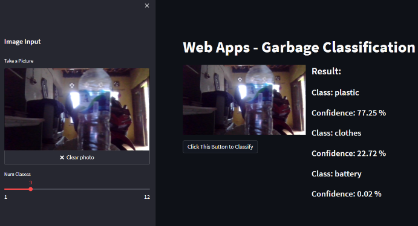

# Garbage Classification using Pytorch
This is Task Week 2 Internship at Nodeflux



### Build Image on Docker

```
$ docker build -t wahyuadinugroho/garbage-classification:latest .
```

### Pull Image from Dockerhub

```
$ docker pull wahyuadinugroho/garbage-classification:latest
```

### Run Image

```
$ docker run -it --rm -p 9000:8501 wahyuadinugroho/garbage-classification:latest .
```
